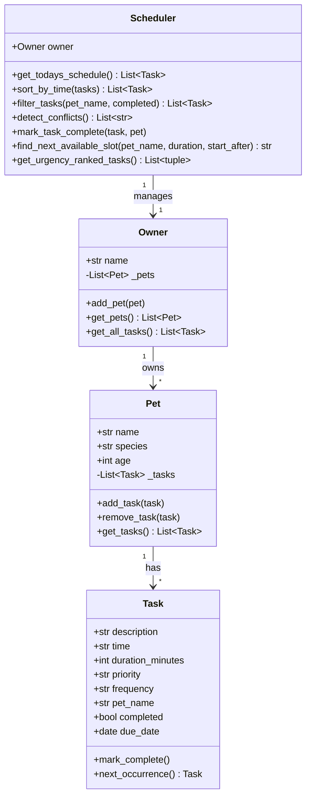

# PawPal+

PawPal+ is a pet care scheduling app built with Python and Streamlit. It helps owners plan and track daily care tasks for their pets.

## Scenario

A busy pet owner needs help staying consistent with pet care. They want a system that:

- Tracks care tasks (walks, feeding, meds, enrichment, grooming)
- Considers constraints (time, priority, frequency)
- Produces a daily plan sorted by time
- Warns about scheduling conflicts

## Features

- Add an owner and multiple pets (dogs, cats, birds, and more)
- Schedule tasks with a description, time, duration, priority, and frequency
- Generate a daily schedule filtered to today's tasks
- Sort tasks chronologically with priority as a tiebreaker
- Filter tasks by pet name or completion status
- Detect conflicts when two tasks for the same pet share the same time slot
- Handle recurring tasks (daily, weekly) by auto-scheduling the next occurrence when a task is marked complete
- Find the next available time slot for a new task given existing commitments
- Rank all pending tasks by a weighted urgency score so the most pressing care gets done first

## Smarter Scheduling

The Scheduler class adds five algorithmic behaviors beyond basic task storage:

Sorting. Tasks are sorted by their HH:MM time string. Zero-padded 24-hour format means lexicographic sort gives correct chronological order. Tasks at the same time are broken by priority (high before medium before low).

Filtering. Any view can be scoped by pet name, completion status, or both. The filter runs on live data from Owner each time it is called, so it always reflects the current state.

Conflict detection. The scheduler checks every task against a dictionary keyed by (pet_name, time, due_date). If the same key appears twice, it emits a plain-English warning string. The app surfaces these as yellow warning banners.

Recurrence. When a daily or weekly task is marked complete, `next_occurrence()` computes the next due date with `timedelta` and adds a fresh Task object to the pet. Once tasks are never recreated.

Next available slot (advanced). `find_next_available_slot(pet_name, duration_minutes, start_after)` runs a gap-detection algorithm over today's schedule for a given pet. It converts every existing task into a busy interval `[start, start + duration)`, sorts those intervals, and scans forward from `start_after` to find the first gap wide enough to fit the requested duration. This is an interval scheduling problem solved in O(n log n) time. The UI lets owners enter a desired duration and receive the earliest open slot in return.

Urgency ranking (advanced). `get_urgency_ranked_tasks()` assigns each incomplete task a numeric urgency score using three weighted signals: priority (high=3, medium=2, low=1), overdue penalty (days overdue times 2, capped at 10), and frequency urgency (daily=1, weekly=0.5, once=0). Tasks are sorted descending by score. A low-priority task overdue by five days scores 11 and outranks a fresh high-priority task scoring 3. The UI shows a ranked table so owners know what needs attention most even when they have limited time.

## How Agent Mode was used

Agent Mode in VS Code Copilot drove the implementation of both advanced algorithms.

For the next available slot finder, the prompt given to Agent Mode was: "I have a Scheduler class with access to a pet's tasks for today. Each task has a time string in HH:MM format and a duration_minutes integer. Write a method that finds the earliest available time slot after a given start time that can fit a task of a given duration. Treat existing tasks as busy intervals and scan for gaps."

Agent Mode generated the interval-conversion helpers `_to_minutes` and `_to_hhmm`, the gap-scanning loop, and the edge-case handling for when the day is full. The initial output used a 23:59 end-of-day boundary. That was changed to 1440 minutes (24 * 60) so a task starting at 23:30 with a 30-minute duration is correctly rejected rather than allowed to wrap past midnight.

For urgency ranking, the prompt was: "Write a method that scores each incomplete task by priority, how many days overdue it is, and how frequently it recurs. Return tasks sorted from highest to lowest urgency." Agent Mode produced the scoring formula and the sort. The overdue penalty was uncapped in the initial version. A cap of 10 was added manually so a task that is 30 days overdue does not dominate the ranking to the point where all other context is lost.

## UI

The app uses a wide layout with a persistent sidebar and five tabs.

Sidebar. Owner setup and pet management live here. Each pet shows a live done/total task count inside a bordered card. Adding a pet triggers a toast notification without clearing the form.

Tabs.

- Today's Schedule. Four st.metric cards at the top show pet count, tasks today, pending count, and completed count. Conflict warnings appear as yellow banners directly below the metrics. The schedule renders as a st.dataframe with typed columns. A task selector at the bottom lets you mark any pending task complete.
- Add Task. A bordered form with two columns. Submitting adds the task immediately and shows a toast confirmation.
- Filter Tasks. Dropdowns for pet name and completion status filter the full task list. Result count shows below the table.
- Urgency Ranking. Tasks ranked by weighted score. The Score column uses st.column_config.ProgressColumn so each row shows a visual bar from 0 to 14 (the maximum possible score).
- Find Available Slot. Returns the earliest free gap in a pet's today schedule that fits the requested duration. Shows the pet's existing tasks as context so you can see why the slot was picked.

## Setup

```
python -m venv .venv
source .venv/bin/activate
pip install -r requirements.txt
```

Run the app:

```
streamlit run app.py
```

Run the CLI demo:

```
python main.py
```

## Testing PawPal+

Run the full test suite:

```
python -m pytest
```

The suite covers:

- Task completion sets the completed flag
- Task addition increases the pet's task count
- Sorting returns tasks in chronological order
- Daily recurrence creates a next-day task after completion
- Weekly recurrence creates a next-week task after completion
- Once tasks produce no next occurrence
- Today's schedule excludes future-dated tasks
- Conflict detection flags two tasks for the same pet at the same time
- Conflict detection does not flag identical times across different pets
- Filtering by pet name and by completion status

Confidence level: 4 out of 5 stars. The core scheduling behaviors are verified. Edge cases left for a future iteration include zero-pet owners, tasks spanning midnight, and overlapping durations (not just identical start times).

## 📸 Demo

<a href="/course_images/ai110/pawpal_demo.png" target="_blank"></a>

## UML Diagram


