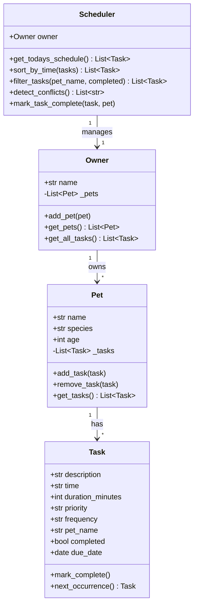

# PawPal+

PawPal+ is a pet care scheduling app built with Python and Streamlit. It helps owners plan and track daily care tasks for their pets.

## Scenario

A busy pet owner needs help staying consistent with pet care. They want a system that:

- Tracks care tasks (walks, feeding, meds, enrichment, grooming)
- Considers constraints (time, priority, frequency)
- Produces a daily plan sorted by time
- Warns about scheduling conflicts

## Features

- Add an owner and multiple pets (dogs, cats, birds, and more)
- Schedule tasks with a description, time, duration, priority, and frequency
- Generate a daily schedule filtered to today's tasks
- Sort tasks chronologically with priority as a tiebreaker
- Filter tasks by pet name or completion status
- Detect conflicts when two tasks for the same pet share the same time slot
- Handle recurring tasks (daily, weekly) by auto-scheduling the next occurrence when a task is marked complete

## Smarter Scheduling

The Scheduler class adds three algorithmic behaviors beyond basic task storage:

Sorting. Tasks are sorted by their HH:MM time string. Zero-padded 24-hour format means lexicographic sort gives correct chronological order. Tasks at the same time are broken by priority (high before medium before low).

Filtering. Any view can be scoped by pet name, completion status, or both. The filter runs on live data from Owner each time it is called, so it always reflects the current state.

Conflict detection. The scheduler checks every task against a dictionary keyed by (pet_name, time, due_date). If the same key appears twice, it emits a plain-English warning string. The app surfaces these as yellow warning banners.

Recurrence. When a daily or weekly task is marked complete, `next_occurrence()` computes the next due date with `timedelta` and adds a fresh Task object to the pet. Once tasks are never recreated.

## Setup

```
python -m venv .venv
source .venv/bin/activate
pip install -r requirements.txt
```

Run the app:

```
streamlit run app.py
```

Run the CLI demo:

```
python main.py
```

## Testing PawPal+

Run the full test suite:

```
python -m pytest
```

The suite covers:

- Task completion sets the completed flag
- Task addition increases the pet's task count
- Sorting returns tasks in chronological order
- Daily recurrence creates a next-day task after completion
- Weekly recurrence creates a next-week task after completion
- Once tasks produce no next occurrence
- Today's schedule excludes future-dated tasks
- Conflict detection flags two tasks for the same pet at the same time
- Conflict detection does not flag identical times across different pets
- Filtering by pet name and by completion status

Confidence level: 4 out of 5 stars. The core scheduling behaviors are verified. Edge cases left for a future iteration include zero-pet owners, tasks spanning midnight, and overlapping durations (not just identical start times).

## 📸 Demo

<a href="/course_images/ai110/pawpal_demo.png" target="_blank"></a>

## UML Diagram


